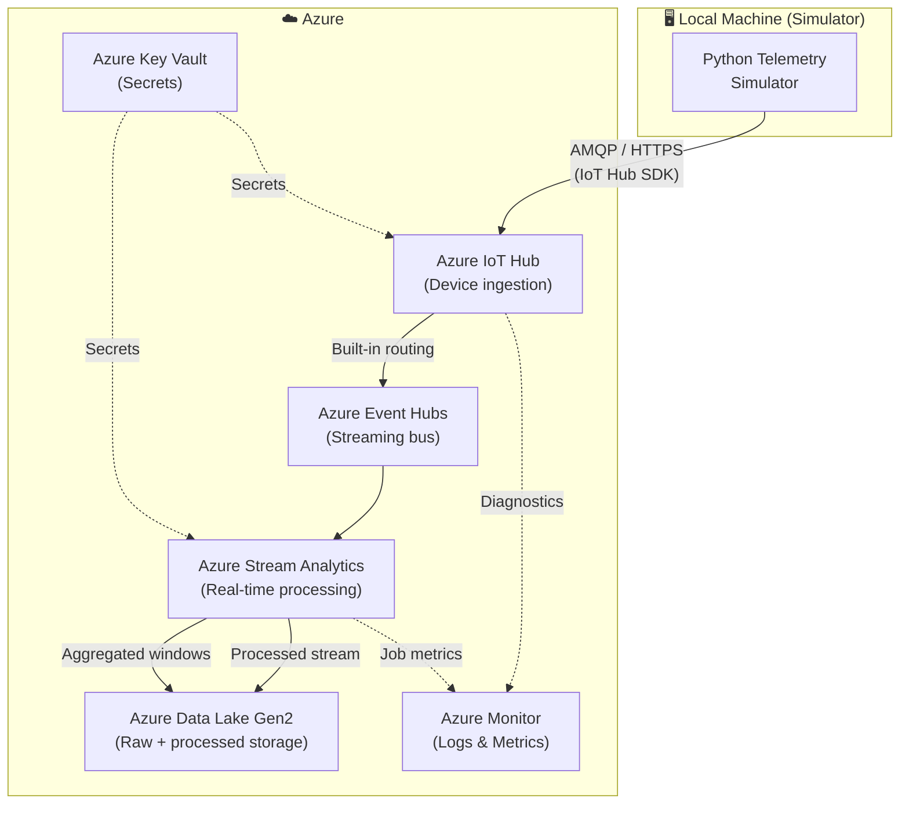
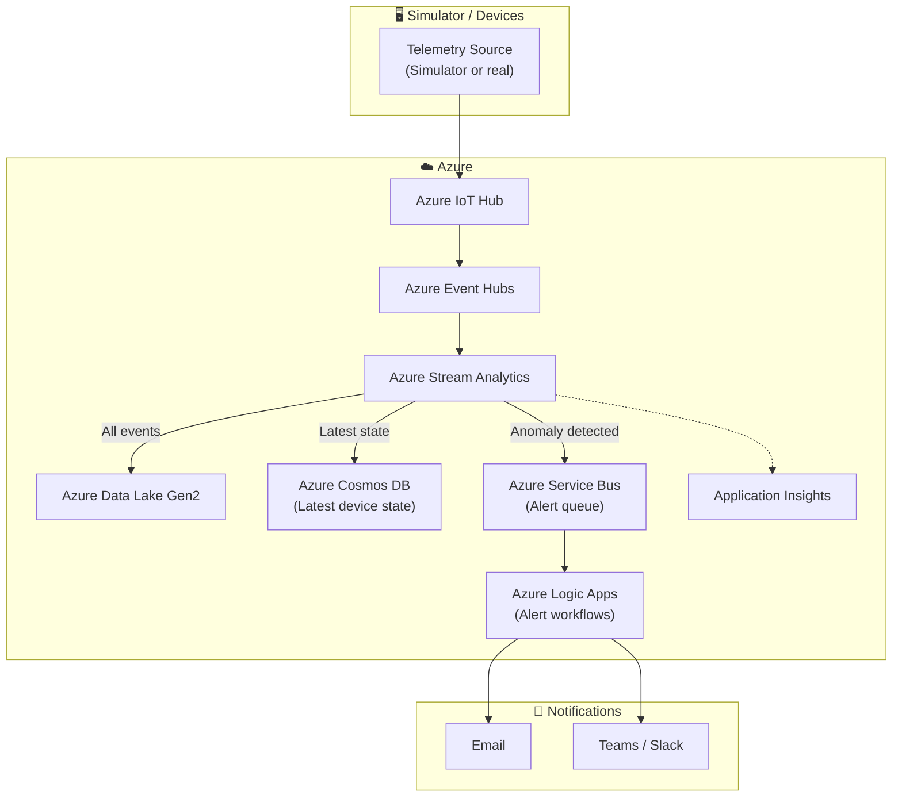
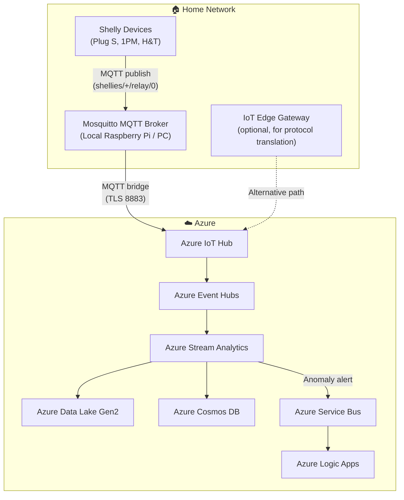
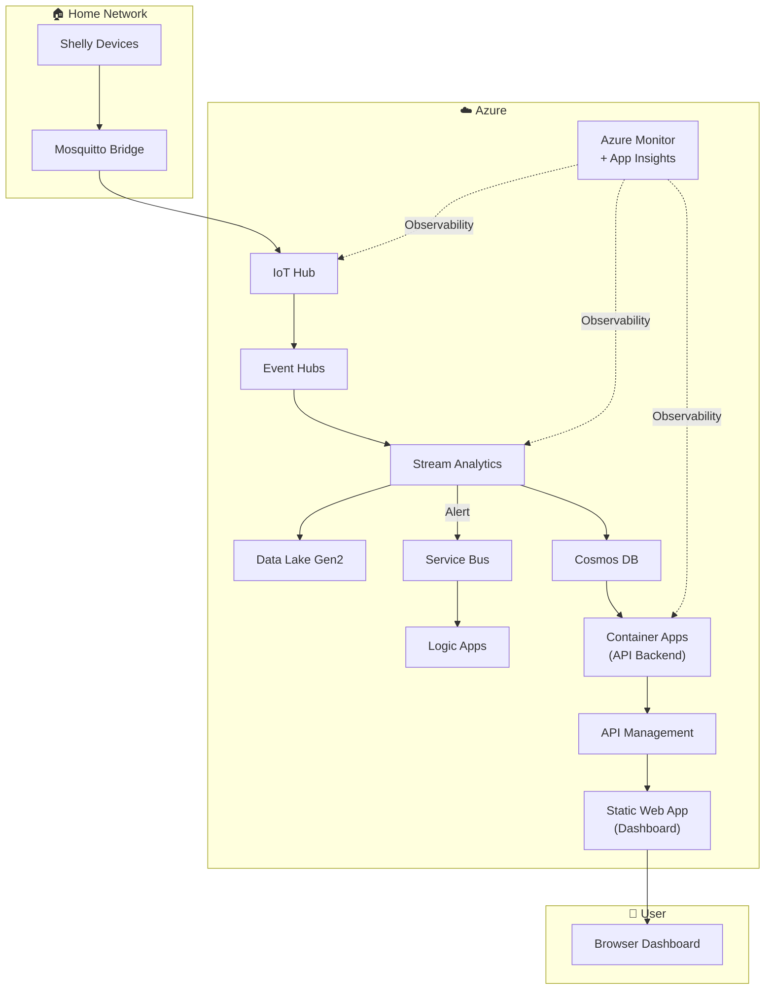
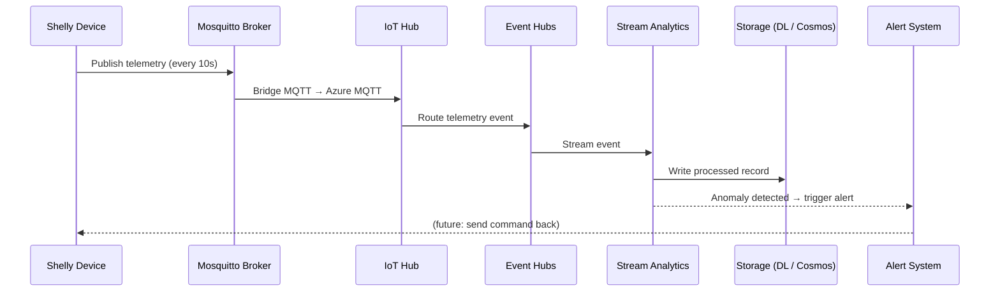

# 🏗️ Architecture Diagrams

## Phase 1 — Foundation (Simulation)

The full Azure pipeline is built and validated using a Python telemetry simulator.
No physical devices required. All data flows and transformations are established here.

---

## Phase 2 — Real-Time Alerting Pipeline

Stream Analytics detects anomalies (e.g. power spike, temperature threshold).
Alerts are routed through Service Bus → Logic Apps → notifications.

---

## Phase 3 — Real Device Integration (Shelly via MQTT)

Physical Shelly devices are connected via a local MQTT broker (Mosquitto)
that bridges messages into Azure IoT Hub. The Azure pipeline is unchanged.

---

## Phase 4 — Full Production Stack

A live web dashboard and scalable microservices backend complete the stack.
API Management provides a secure gateway to all backend services.

---

## Data Flow Summary

